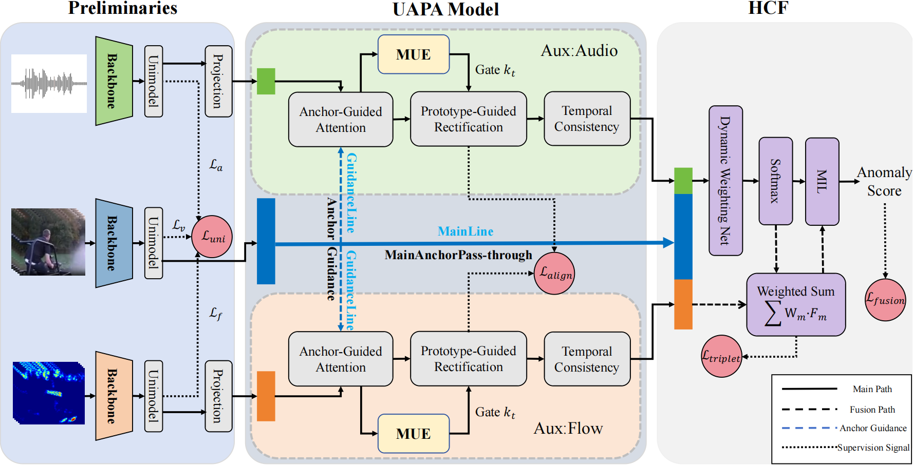

# UAPA-HCF

## Abstract
Weakly supervised multimodal violence detection faces asymmetric information density across visual, audio, and motion channels, and naive fusion often causes modality contamination. We propose UAPA-HCF: Uncertainty-Aware Prototype Anchoring (UAPA) rectifies evidence before fusion, and Holistic Consensus Fusion (HCF) dynamically weights modalities to form a robust decision boundary. Experiments on XD-Violence achieve 87.65% AP.

## Framework



Full-resolution diagram: `Framework.pdf`

## Environment
- Python 3.9
- CUDA 11.8

Install dependencies:
```
pip install -r requirements.txt
```

## Training
```
python uapahcf_train.py
```

## Testing
```
python uapahcf_test.py
```

## Directory Structure (Simplified)
- `models/`: UAPA and HCF modules
- `loss/`: losses
- `run/`: train/test logic
- `cfg/`: configs
- `data/`: dataset loader
- `util/`: utilities
- `lists/`: feature lists and labels
